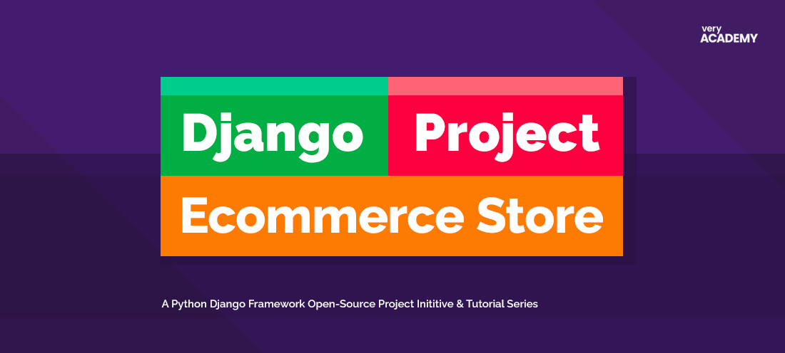

# Django-Ecommerce
The Django-Ecommerce is an open-source project inititive and tutorial series.   

# Tutorials
The tutorials, found here on YouTube take you through the steps of developing an ecommerce application with Python Django, prodominately deploying the Django templating system.

## Course Content

<b>Part-1 Building the product catalogue</b> 
Get the project started with Django Python and build the product catalogue

Part 1

<b>Part-1 Building the product catalogue</b> 
Get the project started with Django Python and build the product catalogue

Part 1

# Contributing
This project welcomes contributions and suggestions. At present, we are not accepting any code contributions. When the tutorials have finished the project will be open to welcome code contributions and further suggestions.

# License
[MIT License](LICENSE)
